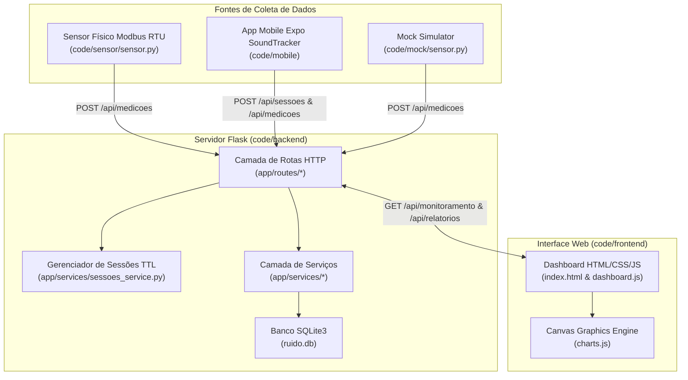

# AGENT.md — Documentação Técnica & Onboarding do Projeto

> Documentação gerada automaticamente para desenvolvedores e agentes de IA sobre a arquitetura, stack, execução e convenções do repositório **TCC Monitor de Ruído (NoiseRadar / SoundTracker)**.

---

## 1. Visão Geral

O **TCC Monitor de Ruído** é um sistema completo de telemetria, monitoramento de níveis de pressão sonora (dB / dBA) e geração de alertas em tempo real. O projeto foi projetado primariamente para execução *headless* (sem interface gráfica direta no sistema operacional) em microcomputadores **Raspberry Pi 3 Model B+**, operando com baixo consumo de recursos e baixo custo operacional.

### Propósito do Sistema
1. **Coleta de Medições Accústicas**: Obter leituras em tempo real provenientes de três origens distintas:
   - Sensores físicos Modbus RTU/RS485 conectados via UART serial (ex: módulo ZTS-ZS-BZ em `/dev/ttyAMA0` ou `/dev/serial0`).
   - Dispositivos móveis utilizando o microfone do smartphone (aplicativo mobile React Native / Expo).
   - Geradores de dados simulados (*Mock Sensors*) para testes de carga e demonstração.
2. **Processamento e Alertas**: Registrar as medições em um banco de dados SQLite local, avaliando instantaneamente se o nível em dB ultrapassou o limite cadastrado para determinado ambiente, gerando alertas imediatos.
3. **Gestão de Sessões Concorrentes**: Controlar em memória o uso dos sensores por dispositivos (evitando que dois smartphones meçam o mesmo ambiente ao mesmo tempo via mecanismo de TTL e *Heartbeat*).
4. **Visualização e Relatórios**: Disponibilizar um Dashboard Web responsivo (com gráficos em Canvas HTML5 desenhados nativamente) e relatórios analíticos em JSON e formato texto (`.txt`) para exportação.

---

## 2. Stack Tecnológica

| Camada / Domínio | Tecnologia / Biblioteca | Versão / Detalhes | Evidência no Código |
| :--- | :--- | :--- | :--- |
| **Linguagem Principal (Backend/IoT)** | Python | `3.10+` / `3.12` | `pyrightconfig.json`, `main.py` |
| **Framework Web Backend** | Flask | Requisitado em `requirements.txt` | `code/backend/app/__init__.py` |
| **Banco de Dados** | SQLite3 | Módulo nativo `sqlite3` | `code/backend/app/database.py` |
| **Comunicação Hardware Serial** | `minimalmodbus`, `pyserial` | Requisitado em `requirements.txt` | `code/backend/app/services/monitoramento_service.py`, `code/sensor/sensor.py` |
| **Cliente HTTP Backend/Mock** | `requests` | Requisitado em `requirements.txt` | `code/mock/sensor.py`, `code/sensor/sensor.py` |
| **Frontend Web** | HTML5, Vanilla CSS3, Vanilla JS (ES Modules) | Sem frameworks CSS/JS pesados | `code/frontend/index.html`, `code/frontend/js/` |
| **Visualização de Gráficos Web** | HTML Canvas API | Renderização manual em 2D Context | `code/frontend/js/charts.js` |
| **Aplicativo Mobile Framework** | React Native / Expo | RN `0.81.5`, Expo `~54.0.33`, React `19.1.0` | `code/mobile/package.json` |
| **Captura de Áudio Mobile** | `expo-av` | `~16.0.8` (Metering de áudio) | `code/mobile/src/hooks/useDecibelMeter.js` |
| **DevOps & Serviço em Boot** | Linux `systemd` | Arquivos `.service` | `code/deploy/monitor-ruido-backend.service`, `code/deploy/monitor-ruido-mock.service` |
| **Análise Estática Python** | Pyright | Configuration file | `pyrightconfig.json`, `code/backend/pyrightconfig.json` |

---

## 3. Estrutura de Pastas

```text
tcc-monitor-ruido/
├── .gitignore                      # Regras de exclusão do Git (ruido.db, .venv, etc.)
├── pyrightconfig.json              # Configuração global de checagem de tipos Pyright
├── readme.md                       # Documentação principal e guia de hardware no Raspberry Pi
├── requirements.txt                # Dependências Python globais do projeto
├── Artigos e Referencias/          # Acervo de artigos científicos em PDF sobre ruído e acústica
├── documentação/                   # Documentação acadêmica, diagramas e relatórios de hardware PDF
└── code/                           # Código-fonte principal da solução
    ├── README.MD                   # Guia de execução técnica detalhado
    ├── backend/                    # Servidor API Flask e Banco SQLite
    │   ├── main.py                 # Entrypoint da aplicação backend
    │   ├── pyrightconfig.json      # Configuração local do Pyright para o backend
    │   ├── requirements.txt        # Dependências locais do backend
    │   └── app/                    # Pacote Flask estruturado
    │       ├── __init__.py         # Application Factory (create_app), CORS e rotas estáticas
    │       ├── database.py         # Conexão SQLite, schema DDL e seed inicial
    │       ├── routes/             # Camada de Controllers / Blueprints HTTP
    │       │   ├── __init__.py     # Blueprint principal (main_bp)
    │       │   ├── ambientes.py    # Endpoints CRUD de ambientes (/api/ambientes)
    │       │   ├── health.py       # Endpoint de diagnóstico (/health)
    │       │   ├── medicoes.py     # Endpoints de inserção, monitoramento e varredura serial
    │       │   ├── relatorios.py   # Endpoints de relatórios analíticos em JSON e TXT
    │       │   └── sessoes.py      # Endpoints de controle de sessões e heartbeat
    │       └── services/           # Camada de Regras de Negócio
    │           ├── __init__.py     # Exportações unificadas dos serviços
    │           ├── ambientes_service.py     # Lógica CRUD de ambientes e estado em_uso
    │           ├── medicoes_service.py      # Ingestão de medições, alertas e consulta
    │           ├── monitoramento_service.py # Agregação de dashboard e leitor Modbus/serial
    │           ├── relatorios_service.py    # Cálculos estatísticos e gerador de relatório TXT
    │           └── sessoes_service.py       # Gerenciamento de sessões em memória (TTL/Lock)
    ├── deploy/                     # Configurações de inicialização no boot do Linux
    │   ├── monitor-ruido-backend.service # Unidade systemd do servidor Flask
    │   └── monitor-ruido-mock.service    # Unidade systemd do mock de sensores
    ├── frontend/                   # Interface Web SPA estática
    │   ├── index.html              # Página principal (Dashboard, cadastros, tabelas, relatórios)
    │   ├── graficos.html           # Página secundária (Gráficos detalhados por ambiente)
    │   ├── asserts/                # Imagens e logotipos (logo_do_tcc_transparente.png)
    │   ├── css/
    │   │   └── style.css           # CSS único com tema escuro e regras de layout/sidebar
    │   └── js/
    │       ├── api.js              # Encapsulamento das chamadas HTTP Fetch para a API
    │       ├── charts.js           # Funções puras de renderização em Canvas HTML5
    │       ├── dashboard.js        # Lógica de atualização periódica e interação da index.html
    │       ├── graficos.js         # Lógica de renderização dos cards na graficos.html
    │       └── utils.js            # Formatadores de data, dB e manipulador fetchJson
    ├── mobile/                     # Aplicativo Mobile React Native / Expo (SoundTracker)
    │   ├── App.js                  # Componente raiz do React Native
    │   ├── app.config.js           # Configuração dinâmica do Expo (extenções, extra.apiBaseUrl)
    │   ├── index.js                # Registro do componente principal via registerRootComponent
    │   ├── package.json            # Dependências e scripts do aplicativo Expo
    │   ├── readme.md               # Documentação específica do app mobile
    │   └── src/
    │       ├── components/         # Componentes visuais UI (ControlButton, MeterBar, etc.)
    │       ├── hooks/              # Custom Hook useDecibelMeter.js (ciclo de áudio e sessão)
    │       ├── services/           # Cliente HTTP da API para o mobile (api.js)
    │       └── shared/             # Utilitários de escala de cores e rótulos de ruído
    ├── mock/                       # Simulador de Sensores em Python
    │   └── sensor.py               # Script de geração simulada de dados (modo dinâmico ou legado)
    └── sensor/                     # Leitor e Scanner de Hardware Serial Real
        ├── scan_modbus_ids.py      # Scanner CLI de portas seriais e IDs Modbus RTU
        └── sensor.py               # Cliente daemon Modbus RTU via UART (/dev/ttyAMA0)
```

---

## 4. Arquitetura do Sistema

A arquitetura foi desenhada no padrão **Layered Monolith + Distributed IoT Edge Data Collectors**, garantindo que o servidor Flask rode com mínimo consumo de CPU/RAM enquanto recebe dados de múltiplas fontes simultaneamente.



### Componentização e Organização Interna

#### 1. Backend Flask (Python)
- **Application Factory Pattern**: A função `create_app()` em [code/backend/app/__init__.py](file:///c:/Users/Station/OneDrive/Documentos/TCC/tcc-monitor-ruido/code/backend/app/__init__.py) inicializa a instância Flask, configura o diretório estático aprontado para `code/frontend`, adiciona cabeçalhos CORS (`Access-Control-Allow-*`) a todas as respostas e executa o bootstrap do banco de dados `init_db()`.
- **Modularização via Blueprints**: As rotas HTTP estão separadas em submódulos dentro de `app/routes/` e agrupadas no `main_bp` (`Blueprint("main", __name__)`).
- **Camada de Serviços Pura**: A lógica de manipulação do SQLite e cálculos estatísticos não fica nas rotas. As funções em `app/services/` gerenciam conexões, SQL queries e conversão de `sqlite3.Row` em dicionários Python via `row_to_dict`.
- **Gerenciador de Sessões com Thread Lock**: O módulo [sessoes_service.py](file:///c:/Users/Station/OneDrive/Documentos/TCC/tcc-monitor-ruido/code/backend/app/services/sessoes_service.py) armazena em memória global (`_sessoes`) as reservas de ambientes por dispositivos mobile (`device_id`). Uma trava de concorrência (`threading.Lock`) garante acesso seguro entre múltiplas threads. Sessões sem heartbeat expiram automaticamente em **60 segundos**.
- **Modbus/Serial Scanner Engine**: O serviço [monitoramento_service.py](file:///c:/Users/Station/OneDrive/Documentos/TCC/tcc-monitor-ruido/code/backend/app/services/monitoramento_service.py) inclui capacidade de varrer a UART física do Raspberry Pi (`/dev/ttyAMA0`, `/dev/serial0`) através da biblioteca `minimalmodbus`, prevenindo conflito de barramento com uma trava `SERIAL_SCAN_LOCK`.

#### 2. Frontend Web (ES Modules & Native Canvas)
- **Zero Build Tool**: Todo o código executa nativamente no navegador utilizando `<script type="module">`.
- **Renderizador Gráfico Customizado**: Em vez de bibliotecas pesadas como Chart.js ou Recharts, o arquivo [charts.js](file:///c:/Users/Station/OneDrive/Documentos/TCC/tcc-monitor-ruido/code/frontend/js/charts.js) implementa funções de desenho direto em contexto 2D (`canvas.getContext("2d")`) para gráficos de linha de tendência, histogramas de % de alerta e gráficos detalhados de histórico.
- **Polling Reativo**: O dashboard atualiza automaticamente a cada 5 segundos através da função `loadDashboard()`, filtrando dinamicamente sensores ativos e exibindo tags coloridas (`ok`, `warn`, `muted-tag`).

#### 3. Aplicativo Mobile (React Native / Expo)
- **Captura de Decibéis em Tempo Real**: O hook [useDecibelMeter.js](file:///c:/Users/Station/OneDrive/Documentos/TCC/tcc-monitor-ruido/code/mobile/src/hooks/useDecibelMeter.js) utiliza `expo-av` para capturar a potência da entrada do microfone (`status.metering`), aplicando a fórmula de atenuação `90 + status.metering` suavizada por filtro exponencial:
  $$\text{dB}_{\text{suavizado}} = (\text{dB}_{\text{anterior}} \times 0.7) + (\text{dB}_{\text{atual}} \times 0.3)$$
- **Fluxo de Reserva de Ambiente**: Antes de gravar, o app solicita ocupação (`POST /api/sessoes`). Se aceito, inicia envio de medições a cada 2s e heartbeat a cada 10s. Ao parar ou fechar o app, envia liberação (`DELETE /api/sessoes/<sensor_id>`).

---

## 5. Fluxo de Dados da Aplicação

### Fluxo Completo de Ingestão e Exibição

1. **Origem da Medição**:
   - **Hardware Físico**: `code/sensor/sensor.py` faz a leitura do registrador Modbus RTU (ex: registrador `0`) via serial `/dev/ttyAMA0`, obtendo valor inteiro e dividindo por 10 (ex: `452` $\rightarrow$ `45.2 dB`).
   - **Mobile App**: `useDecibelMeter.js` calcula o nível de dB via microfone do smartphone.
   - **Mock Generator**: `code/mock/sensor.py` gera valores flutuantes com 12% de probabilidade de picos (*spikes*).
2. **Ingestão HTTP**:
   - A leitura é enviada via **POST** para `/api/medicoes` com a carga JSON: `{"sensor_id": "lab-a-01", "db": 68.5}`.
3. **Processamento no Backend**:
   - `http_create_medicao` $\rightarrow$ `medicoes_service.create_medicao(payload)`.
   - O backend verifica no SQLite se o `sensor_id` existe na tabela `ambientes` e se está `ativo = 1`.
   - Compara `db` com `ambiente.limite_db`:
     - Se `db > limite_db`, define `excedeu_limite = 1` e insere uma linha correspondente na tabela `alertas` com a mensagem `"Ruído acima do limite em {nome}: {db} dB"`.
   - Salva a medição na tabela `medicoes` com carimbo ISO UTC.
4. **Atualização do Dashboard Web**:
   - O navegador faz um **GET** periódico (`/api/monitoramento?limit=80`).
   - O backend retorna a lista de ambientes, a última medição de cada um, as 80 medições recentes e os últimos 20 alertas.
   - O JavaScript re-renderiza os cards e redesenha as curvas nos elementos `<canvas>`.

---

## 6. Convenções de Código Utilizadas

### Nomenclatura
- **Python (Backend e Scripts)**:
  - Funções, variáveis e colunas de banco em `snake_case` (ex: `create_ambiente`, `limite_db`, `sensor_id`).
  - Módulos e arquivos em `snake_case` (ex: `ambientes_service.py`).
  - Constantes globais em `UPPER_SNAKE_CASE` (ex: `SERIAL_SCAN_LOCK`, `SESSAO_TTL_SEGUNDOS`).
- **JavaScript / React Native (Frontend & Mobile)**:
  - Variáveis, funções e hooks em `camelCase` (ex: `fetchAmbientes`, `useDecibelMeter`, `isRecording`).
  - Componentes React Native e arquivos de componente em `PascalCase` (ex: `SensorSelector.js`, `MeterDisplay.js`).
  - Arquivos utilitários e de API em `camelCase.js` (ex: `api.js`, `charts.js`).
- **Endpoints HTTP / API REST**:
  - Substantivos no plural em `kebab-case` ou `snake_case` minúsculo (ex: `/api/ambientes`, `/api/medicoes`, `/api/sensores/fisicos`).

### Organização de Imports
- **Python**: 
  1. Imports da biblioteca padrão (`sys`, `pathlib`, `threading`, `datetime`).
  2. Imports de terceiros (`flask`, `requests`, `serial`, `minimalmodbus`).
  3. Imports internos do pacote (`from .database import ...`, `from app.services import ...`).
- **JavaScript**:
  - Módulos ES6 com rotas relativas explícitas (`import { formatDb } from "./utils.js";`).

### Alias e Resolução de Caminhos
- No backend Python, o caminho para o diretório raiz `code/backend` é injetado em `sys.path` no inicializador [main.py](file:///c:/Users/Station/OneDrive/Documentos/TCC/tcc-monitor-ruido/code/backend/main.py) e configurado em `pyrightconfig.json` para suportar imports absolutos a partir de `app`.

---

## 7. Tecnologias que um Desenvolvedor Precisa Conhecer

Para colaborar neste repositório, o desenvolvedor deve dominar:

1. **Python 3 (Avançado)**: Compreensão de decoradores, context managers (`with`), manipulação de exceções, concorrência com `threading.Lock` e gestão de ambientes virtuais (`venv`).
2. **Flask & REST API Architecture**: Padrão de rotas HTTP, Blueprints, status codes (200, 201, 400, 404, 409, 500), serialização JSON e tratamento de cabeçalhos CORS.
3. **SQLite3 & SQL DDL/DML**: Consultas relacionais com `JOIN`, agregação (`COUNT`, `SUM`, `AVG`, `MAX`, `MIN`), chaves primárias e estrangeiras (`FOREIGN KEY`), e concorrência no SQLite.
4. **Comunicação Serial & Modbus RTU**: Protocolo RS485/UART, baudrates (9600 8N1), slave addresses, function codes (03 Holding Register, 04 Input Register) e uso das bibliotecas `pyserial` e `minimalmodbus`.
5. **HTML5 Canvas API (JavaScript)**: Métodos do `CanvasRenderingContext2D` (`fillRect`, `beginPath`, `lineTo`, `arc`, `fillText`, `stroke`) para renderização manual de dados estatísticos sem dependências de terceiros.
6. **React Native & Expo Ecosystem**: Desenvolvimento mobile cross-platform, ciclo de vida de componentes React, Custom Hooks (`useRef`, `useState`, `useEffect`), manipuladores de áudio (`expo-av`) e gerenciamento de estado assíncrono.
7. **Linux Systemd & Hardware Raspberry Pi**: Criação de arquivos `.service`, gerenciamento de daemons via `systemctl`, inspeção de logs com `journalctl` e configuração de periféricos seriais (`raspi-config`, `/boot/config.txt`).

---

## 8. Dependências Importantes

### Backend & Scripts Python (`requirements.txt`)

- **`flask`**: Servidor de aplicação WSGI/HTTP que provê a API REST e distribui os arquivos estáticos do frontend.
- **`requests`**: Cliente HTTP utilizado pelos daemons simuladores e leitores seriais para enviar payloads JSON ao backend.
- **`minimalmodbus`**: Biblioteca especializada no protocolo Modbus RTU sobre porta serial, responsável pela conversão física dos bytes lidos na linha RS485 para números inteiros/flutuantes.
- **`pyserial`**: Driver de baixo nível para abertura e configuração das portas seriais do Linux (ex: `/dev/ttyAMA0`, `/dev/ttyS0`, `/dev/serial0`).

### Mobile App (`code/mobile/package.json`)

- **`expo` (`~54.0.33`)**: Plataforma e SDK de desenvolvimento mobile.
- **`expo-av` (`~16.0.8`)**: Módulo de áudio e vídeo do Expo responsável pelo acesso ao microfone do dispositivo e extração dos níveis de ruído em tempo real (*metering*).
- **`expo-constants` (`~18.0.13`)**: Provê acesso a variáveis de configuração configuradas no `app.config.js` (como `extra.apiBaseUrl`).
- **`expo-status-bar` (`~3.0.9`)**: Utilitário para personalização da barra de status do smartphone.
- **`react` (`19.1.0`) & `react-native` (`0.81.5`)**: Núcleo do framework de interface mobile.

---

## 9. Scripts do Projeto

### Scripts do App Mobile (`code/mobile/package.json`)

- `npm run start` ou `npx expo start`: Inicia o Expo Dev Server e gera o QR Code para conexão via app Expo Go.
- `npm run android` ou `npx expo start --android`: Executa o app no emulador Android ou dispositivo conectado via ADB.
- `npm run ios` ou `npx expo start --ios`: Executa o app no emulador iOS (exige macOS).
- `npm run web` ou `npx expo start --web`: Executa a versão web experimental do Expo.

### Scripts CLI Python do Repositório

- **Execução do Backend**:
  ```bash
  python code/backend/main.py
  ```
  *Inicia o servidor Flask na porta 5000 (configurável via variáveis de ambiente).*

- **Simulador / Mock de Sensores**:
  ```bash
  python code/mock/sensor.py --dynamic --interval 5
  ```
  *Busca automaticamente os ambientes do backend a cada 30s e gera medições contínuas a cada 5s.*

- **Scanner de Hardware Serial Modbus**:
  ```bash
  python code/sensor/scan_modbus_ids.py --port /dev/ttyAMA0 --baudrate 9600 --start-id 1 --end-id 32
  ```
  *Varre a porta serial em busca de sensores físicos Modbus RTU que estejam ativos.*

- **Cliente do Sensor Físico**:
  ```bash
  python code/sensor/sensor.py --port /dev/ttyAMA0 --slave-addr 1 --register 0 --sensor-id e06a-001
  ```
  *Lê o hardware real e envia os dados para a API a cada 2 segundos.*

---

## 10. Variáveis de Ambiente

Todas as variáveis possuem valores padrão seguros para desenvolvimento local.

| Variável | Módulo / Escopo | Descrição | Valor Padrão |
| :--- | :--- | :--- | :--- |
| `APP_HOST` | Backend Flask (`main.py`) | Endereço IP de escuta do servidor Flask | `"0.0.0.0"` |
| `APP_PORT` | Backend Flask (`main.py`) | Porta de escuta do servidor Flask | `"5000"` |
| `APP_DEBUG` | Backend Flask (`main.py`) | Habilita o modo de depuração do Flask (`1` para ligado, `0` para desligado) | `"0"` |
| `API_BASE_URL` | App Mobile (`app.config.js`) | URL base da API REST acessada pelo smartphone | `"http://127.0.0.1:5000"` |
| `PYTHONUNBUFFERED` | Linux Systemd | Força a escrita imediata de logs do Python sem buffer | `"1"` |

---

## 11. Como Executar o Projeto

### Passo 1: Pré-requisitos
- Python 3.10 ou superior instalado.
- Node.js 18+ e npm (necessários apenas para o app mobile).
- Git.

### Passo 2: Clonar e Configurar o Ambiente Virtual Python
```bash
# Clonar o repositório
git clone https://github.com/thiagoeu/tcc-monitor-ruido.git
cd tcc-monitor-ruido

# Criar ambiente virtual na raiz
python -m venv .venv

# Ativar ambiente virtual
# No Linux / macOS / Raspberry Pi:
source .venv/bin/activate
# No Windows PowerShell:
# .\.venv\Scripts\Activate.ps1

# Atualizar pip e instalar dependências
python -m pip install --upgrade pip
pip install -r requirements.txt
```

### Passo 3: Executar o Backend
```bash
python code/backend/main.py
```
O servidor estará rodando em `http://127.0.0.1:5000` (ou no IP local da sua rede).
*Nota*: O banco SQLite `code/backend/ruido.db` e os ambientes padrão (`Sala Principal` e `Biblioteca`) serão criados automaticamente.

### Passo 4: Testar o Dashboard Web
Abra o navegador em:
`http://localhost:5000` ou `http://<IP_DO_SEU_COMPUTADOR>:5000`

### Passo 5: Executar o Simulador de Sensores (Terminal 2)
Em uma nova janela de terminal (com a `.venv` ativada):
```bash
python code/mock/sensor.py --dynamic
```

### Passo 6: Executar o App Mobile (Opcional - Terminal 3)
```bash
cd code/mobile
npm install

# Para conectar ao backend local da sua máquina na mesma rede Wi-Fi:
# No Windows PowerShell: $env:API_BASE_URL="http://192.168.X.X:5000"
# No Linux/macOS: export API_BASE_URL="http://192.168.X.X:5000"

npx expo start
```
Escaneie o QR Code exibido na tela usando o aplicativo **Expo Go** no seu Android ou iOS.

---

## 12. Fluxo de Desenvolvimento e Contribuição

Para manter a integridade do repositório, o colaborador deve seguir este fluxo:

1. **Atualizar a branch principal**:
   ```bash
   git checkout code
   git pull origin code
   ```
2. **Criar uma branch de funcionalidade**:
   ```bash
   git checkout -b feature/nome-da-funcionalidade
   ```
3. **Desenvolver e Testar Localmente**:
   - Garantir que a alteração não quebre a execução do `main.py`.
   - Se alterar esquemas de banco, verificar o arquivo `database.py`.
4. **Executar verificação de tipos (Pyright)**:
   ```bash
   pyright
   ```
5. **Commit e Push**:
   ```bash
   git add .
   git commit -m "feat: adiciona suporte a nova funcionalidade X"
   git push origin feature/nome-da-funcionalidade
   ```
6. **Abrir Pull Request**: Solicitar revisão antes de realizar o merge para a branch principal.

---

## 13. Boas Práticas Específicas deste Projeto

- **Tratamento de Exceções no Loop do Hardware**: Daemons seriais nunca devem interromper abruptamente o loop principal em caso de ruído elétrico na porta serial. Sempre trate `serial.SerialException` ou `minimalmodbus.ModbusException` dentro do bloco `try/except` do loop e aguarde o próximo intervalo.
- **Isolamento da Camada Estática**: O backend entrega os arquivos estáticos do frontend via `send_from_directory`. Não adicione rotas HTTP no Flask que coincidam com nomes de arquivos estáticos.
- **Evitar Chamadas de Leitura Concorrente na UART**: A porta serial RS485 é um meio meio-duplex (*half-duplex*). Nunca acesse a serial em duas threads separadas sem utilizar a trava `SERIAL_SCAN_LOCK`.
- **Limpeza Automática de Memória**: O dicionário de sessões ativas deve sempre executar `_limpar_expiradas()` antes de qualquer operação de leitura ou escrita para evitar vazamento de memória com sessões abandonadas.

---

## 14. Glossário do Projeto

- **dB SPL (Sound Pressure Level)**: Nível de Pressão Sonora medido em decibéis em relação ao valor de referência auditivo.
- **Modbus RTU**: Protocolo de comunicação serial amplamente utilizado em automação industrial e sensores ambientais.
- **Slave Address / ID Modbus**: Endereço numérico (1 a 247) que identifica um dispositivo específico em um barramento RS485.
- **Holding Register**: Registrador Modbus de 16 bits com suporte a leitura e escrita (Function Code 3).
- **Input Register**: Registrador Modbus de 16 bits exclusivo para leitura de dados de sensores (Function Code 4).
- **Sensor ID**: Identificador textual atribuído ao sensor no sistema (ex: `e06a-001`, `lab-a-01`).
- **Device ID**: Identificador único em memória gerado por uma instância do app mobile para controlar a reserva de um ambiente.
- **TTL (Time to Live)**: Tempo de vida de uma sessão em memória (fixado em 60 segundos).
- **Heartbeat**: Requisição periódica (`PUT /api/sessoes/<sensor_id>/heartbeat`) enviada a cada 10s pelo app mobile para renovar o TTL e manter a reserva do ambiente ativa.

---

## 15. Observações Importantes para Novos Desenvolvedores / IAs

> [!IMPORTANT]
> 1. **Localização do Banco de Dados**: O banco SQLite é criado dinamicamente no caminho `code/backend/ruido.db` na primeira execução. Ele está listado no `.gitignore` e nunca deve ser commitado no repositório.
> 2. **Sensores Padrão do Bootstrapping**: A função `seed_default_environments()` cria automaticamente dois ambientes iniciais se eles não existirem:
>    - **Sala Principal** (Sensor `e06a-001`, Limite `65.0 dB`).
>    - **Biblioteca** (Sensor `e06a-002`, Limite `60.0 dB`).
> 3. **Fator de Escala Modbus (Divisão por 10)**: A grande maioria dos sensores comerciais de ruído Modbus RTU (como a linha ZTS-ZS-BZ) transmite o valor sem vírgula multiplicado por 10. Exemplo: um valor bruto de `548` no registrador Modbus equivale a `54.8 dB`. O script `code/sensor/sensor.py` aplica essa divisão automaticamente.
> 4. **Configuração de Serial no Raspberry Pi**: Para que a UART `/dev/ttyAMA0` funcione no Raspberry Pi 3 B+, o console serial deve ser desabilitado no `raspi-config` e a flag `dtoverlay=disable-bt` deve ser adicionada ao `/boot/config.txt` para liberar o hardware serial do Bluetooth.
> 5. **Configuração do Microfone I2S (INMP441)**: Para capturar áudio bruto diretamente do Raspberry Pi, o pino I2S deve ser ativado.
>    - **Fiação no Raspberry Pi 3**:
>      - `VDD` $\rightarrow$ `3.3V (Pino 1)`
>      - `GND` $\rightarrow$ `GND (Pino 6)`
>      - `L/R` $\rightarrow$ `GND (Pino 6)` (Seleciona canal esquerdo mono)
>      - `SCK` $\rightarrow$ `GPIO18 (Pino 12)`
>      - `WS` $\rightarrow$ `GPIO19 (Pino 35)`
>      - `SD` $\rightarrow$ `GPIO20 (Pino 38)`
>    - É necessário adicionar `dtoverlay=googlevoicehat-soundcard` (ou overlay I2S compatível) no `/boot/config.txt` e compilar o módulo do kernel caso a distribuição Raspberry Pi OS não traga o driver I2S mmap habilitado nativamente. O script de leitura encontra-se em `code/hardware/sensor_mic.py`.
