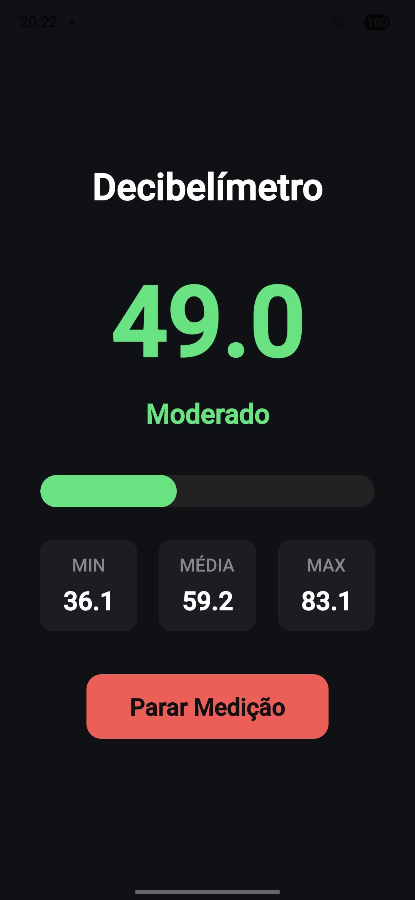

# SoundTracker 🔊

Aplicativo mobile desenvolvido com React Native + Expo para medição de níveis sonoros em tempo real utilizando o microfone do dispositivo.

O projeto utiliza a nova biblioteca `expo-audio` para captura de áudio e leitura de metering, permitindo criar um decibelímetro moderno, leve e responsivo.

---

# ✨ Funcionalidades

- 🎤 Medição sonora em tempo real
- 📊 Exibição de dB atual
- 📈 Monitoramento de:
  - Valor mínimo
  - Valor médio
  - Valor máximo
- 🎨 Indicadores visuais por nível de ruído
- 📶 Barra de intensidade sonora
- ▶️ Controle de iniciar/parar medição
- ⚡ Atualização em tempo real
- 🧠 Suavização de leitura (smoothing)
- 📱 Interface moderna e responsiva

---

# 🛠️ Tecnologias utilizadas

- React Native
- Expo
- expo-audio
- JavaScript

---

# 📂 Estrutura do projeto

```bash
src/
 ├── components/
 │    ├── ControlButton.js
 │    ├── MeterBar.js
 │    ├── MeterDisplay.js
 │    ├── NoiseStatus.js
 │    └── StatsPanel.js
 │
 ├── hooks/
 │    └── useDecibelMeter.js
```

---

# 🚀 Como executar o projeto

## 1. Clonar o repositório

```bash
git clone <https://github.com/thiagoeu/react-native-decibelimetro.git>
```

---

## 2. Instalar dependências

```bash
npm install
```

---

## 3. Executar o projeto

```bash
npx expo start
```

---

# 📱 Testando no Android

1. Instale o aplicativo Expo Go no celular
2. Escaneie o QR Code gerado
3. Permita acesso ao microfone

---

# ⚠️ Sobre a medição de decibéis

Os valores exibidos são aproximações baseadas no metering do microfone do dispositivo.

A precisão pode variar dependendo de:

- Modelo do celular
- Qualidade do microfone
- Processamento de áudio do sistema
- Cancelamento de ruído
- Controle automático de ganho (AGC)

O aplicativo não substitui equipamentos profissionais de medição sonora.

---

# 🧠 Como funciona a leitura

O app utiliza o valor de `metering` retornado pelo `expo-audio`, aplicando:

- Conversão aproximada para escala dB SPL
- Suavização de leitura
- Filtro de ruído mínimo
- Atualização periódica

---

# 📸 Screenshots

<p align="center">
  
</p>

# 📄 Licença

Este projeto está sob a licença MIT.
